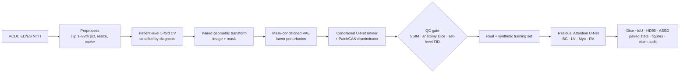

# Generative Augmentation for Cardiac MRI Segmentation (VAE-GAN + Attention U-Net)

A reproducible PyTorch pipeline for **data-efficient cardiac MRI segmentation** on small cohorts. A mask-conditioned VAE and a conditional GAN refiner generate anatomically aligned synthetic image–mask pairs. A quality-control (QC) gate filters them, and a residual Attention U-Net segments the **left ventricle (LV), myocardium (Myo) and right ventricle (RV)** on the [ACDC](https://www.creatis.insa-lyon.fr/Challenge/acdc/) benchmark.

The pipeline doesn't hard-code any results. Every table, statistical test, timing and figure is built from saved run artifacts, and a built-in audit checks reported numbers against those artifacts.

---

## Pipeline overview



### How synthetic pairs stay anatomically aligned

1. A real image and its mask receive the **same** geometric transform.
2. The VAE encodes the transformed image together with the one-hot mask.
3. Only the latent code is perturbed, which changes appearance and texture.
4. The decoder synthesises a new image **conditioned on the unchanged mask**.
5. The adversarial refiner sees both the coarse image and that same mask.

Each synthetic pair is therefore `(generated image, conditioning mask)`. The anatomy is preserved by construction, so the method doesn't have to assume that latent movement produces a known spatial deformation.

---

## Models

| Component | Implementation | File |
|---|---|---|
| Mask-conditioned VAE | Conv encoder on image ⊕ one-hot mask → 128-d latent; decoder fuses latent with a separate mask encoder; L1 + β·KL loss | `cardiac_aug/models/cvae.py` |
| Conditional refiner (G) | pix2pix-style U-Net generator taking coarse image ⊕ one-hot mask | `cardiac_aug/models/patchgan.py` |
| PatchGAN discriminator (D) | 70×70-style patch critic conditioned on the mask | `cardiac_aug/models/patchgan.py` |
| Segmenter | Residual Attention U-Net (4 levels, attention gates on every skip, InstanceNorm, dropout) | `cardiac_aug/models/attention_unet.py` |

## Ablation conditions

| Condition | Real transforms | Synthetic source | QC |
|---|:---:|---|:---:|
| `baseline` | – | none | – |
| `geometric` | ✓ | none | – |
| `vae` | ✓ | mask-conditioned VAE | – |
| `gan` | ✓ | conditional refiner from corrupted real MRI | – |
| `hybrid_no_qc` | ✓ | latent-perturbed VAE → refiner | – |
| `hybrid_qc` | ✓ | latent-perturbed VAE → refiner | ✓ |

Each condition is trained across **5 folds × 3 seeds (42, 1337, 2026)**. All generative and QC models are fitted **inside each fold on training patients only**. Validation patients are used only for early stopping, and test patients are scored once at the end.

---

## Repository contents

> **Note:** the full, maintained codebase is currently packaged in `hybrid-vae-gan-cardiac.zip`. Extract it before running anything (see Quick start).

```text
.
├── hybrid-vae-gan-cardiac.zip      # ← complete package (source, configs, tests, scripts)
├── requirements.txt                # legacy pip requirements (superseded by pyproject.toml)
├── Usages Instruction.sh           # legacy usage notes (refers to the old single-file prototype)
└── Full coding file _VE.py         # legacy shape-test script for the old prototype
```

Inside the archive:

```text
hybrid-vae-gan-cardiac/
├── cardiac_aug/
│   ├── data/            # ACDC discovery, preprocessing, patient folds, paired transforms
│   ├── models/          # MaskConditionedVAE, ConditionalRefiner, PatchDiscriminator, AttentionUNet
│   ├── training/        # VAE / GAN / segmentation loops and CSV logging
│   ├── evaluation/      # metrics, QC, statistics, cost–benefit, claim audit, explainability
│   ├── visualization/   # manuscript-ready figures
│   ├── config.py        # typed experiment configuration
│   └── experiment.py    # per-seed/per-fold orchestration
├── configs/             # default.yaml (full study), smoke.yaml (CPU test), manuscript_claims.yaml
├── scripts/             # CLI entry points (prepare, run, aggregate, figures, audit, synthetic fixture)
├── tests/               # unit tests: model shapes/backprop, metrics, fold disjointness, paired stats
├── docs/OUTPUT_SCHEMA.md
├── notebooks/
├── pyproject.toml · environment.yml · Makefile
```

---

## Quick start

### 1. Get the code

```bash
git clone https://github.com/datascintist-abusufian/Generative-Augmentation-Using-VAE-GAN-and-Attention-U-Net.git
cd Generative-Augmentation-Using-VAE-GAN-and-Attention-U-Net
unzip hybrid-vae-gan-cardiac.zip
cd hybrid-vae-gan-cardiac
```

### 2. Install (Python 3.10–3.11; CUDA GPU recommended)

```bash
conda env create -f environment.yml
conda activate hybrid-card-mri
```

or

```bash
python -m venv .venv && source .venv/bin/activate
pip install -e ".[dev]"
```

### 3. Check the install on CPU (no ACDC download needed)

```bash
make test     # unit tests
make smoke    # builds a tiny synthetic ACDC-shaped dataset and runs all 6 conditions on 1 fold
```

The smoke run only shows that the software works end to end. **Don't report its outputs as results.**

### 4. Run the full study on ACDC

Download the labelled ACDC training set (under its licence terms) and place it like this:

```text
data/raw/ACDC/database/training/
  patient001/
    Info.cfg
    patient001_frame01.nii.gz
    patient001_frame01_gt.nii.gz
    ...
```

Then run:

```bash
make prepare                                                         # preprocess + cache
python scripts/run_experiment.py --config configs/default.yaml       # all seeds × folds
# or one unit at a time:
python scripts/run_experiment.py --config configs/default.yaml --seed 42 --fold 0
make aggregate figures audit
```

During preprocessing, ACDC labels are remapped from `1=RV, 2=Myo, 3=LV` to the internal order `1=LV, 2=Myo, 3=RV`. Physical voxel spacing is kept so that distance metrics are in mm.

---

## Outputs

Per seed/fold, under `runs/seed_<s>/fold_<f>/`:

- `split.json`: exact train/validation/test patient lists
- `generative/{vae,gan,hybrid}/training.csv` and `*_candidates.npz`: generator logs and samples
- `generative/hybrid_qc.qc.json`: candidate and retained counts, thresholds, FID values, pass/fail
- `generative/lineage.json`: shows that every synthetic sample came from training patients only
- `conditions/<name>/{training.csv, best.pt, patient_metrics.csv, runtime.json}`

Aggregated, under `runs/summary/`:

- `patient_level_metrics.csv`, `performance_summary.csv`, `paired_statistics.csv`, `cost_benefit.csv`
- LaTeX tables: `segmentation_results.tex`, `statistical_analysis.tex`, `cost_benefit.tex`
- `figures/performance.png`, `figures/qualitative_and_xai.png` (overlays, input attribution, attention-gate maps)
- `manuscript_claim_audit.csv`, `completeness.json`

Aggregation is **strict**. If any configured seed, fold or condition is missing, it writes `completeness.json` and stops. Use `--allow-incomplete` only for debugging.

---

## Evaluation and statistics

- **Metrics:** per-class and mean Dice, IoU, HD95 and ASSD in physical units. An empty prediction or target receives a field-of-view-diagonal surface penalty, so failed cases count against the model.
- **Statistical unit:** the patient. ED and ES are averaged per patient, and seeds are averaged per patient before testing, so repeat seeds aren't counted as extra patients.
- **Tests:** patient-paired Wilcoxon signed-rank, bootstrap 95% CIs, Cohen's *d*z, Bonferroni correction.

## Quality control

- **SSIM window:** rejects near-copies and implausible outliers relative to the source image.
- **Anatomical plausibility:** a frozen, fold-local baseline segmenter must recover the conditioning mask above a Dice threshold.
- **Set-level FID:** Fréchet distance between real and synthetic sets, using features from the training-only cardiac segmentation encoder (PCA fitted on real training features). This is computed per set, not per image, and doesn't use ImageNet/Inception features.

---

## Reproducibility

- The resolved config and software/hardware provenance are written at run start.
- Python, NumPy and PyTorch RNGs are seeded, and deterministic algorithms are requested.
- Patient folds are saved to disk and checked for disjointness.
- `configs/manuscript_claims.yaml` lists reported values. The audit labels each one `SUPPORTED_WITHIN_TOLERANCE`, `NOT_REPRODUCED` or `NO_EVIDENCE`. Don't widen tolerances to force a match.

## Limitations

- ACDC is a single-centre dataset. External validation and clinician reader studies aren't included.
- Reported performance figures count as evidence only after a complete real-data run produces matching artifacts and the claim audit supports them.
- The full study (6 conditions × 5 folds × 3 seeds, with generative models retrained per fold) is computationally expensive.

---

## Citation

If you use this code, please cite the ACDC challenge:

> O. Bernard *et al.*, "Deep Learning Techniques for Automatic MRI Cardiac Multi-Structures Segmentation and Diagnosis: Is the Problem Solved?", *IEEE Transactions on Medical Imaging*, 37(11), 2514–2525, 2018.

Please also cite the original architectures: VAE (Kingma & Welling, 2014), pix2pix/PatchGAN (Isola *et al.*, 2017) and Attention U-Net (Oktay *et al.*, 2018).

## Author

**Md Abu Sufian**, PhD researcher, University of East London · [databizanalyst.com](https://databizanalyst.com)

## Licence

No licence has been declared yet. Until one is added, all rights are reserved by the author.
